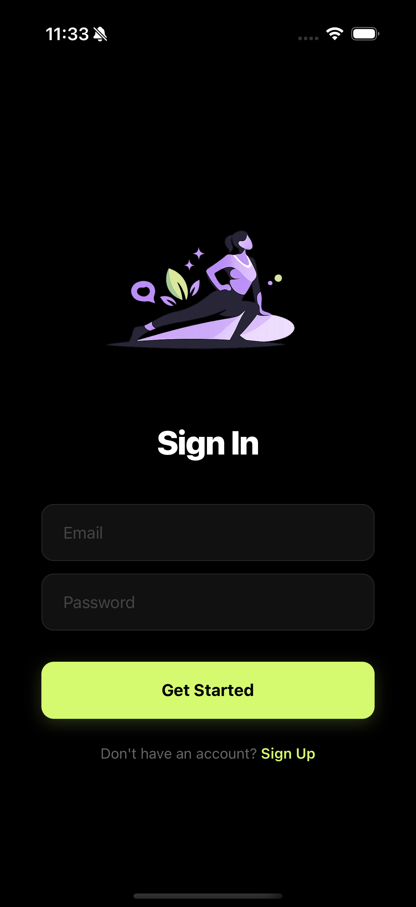
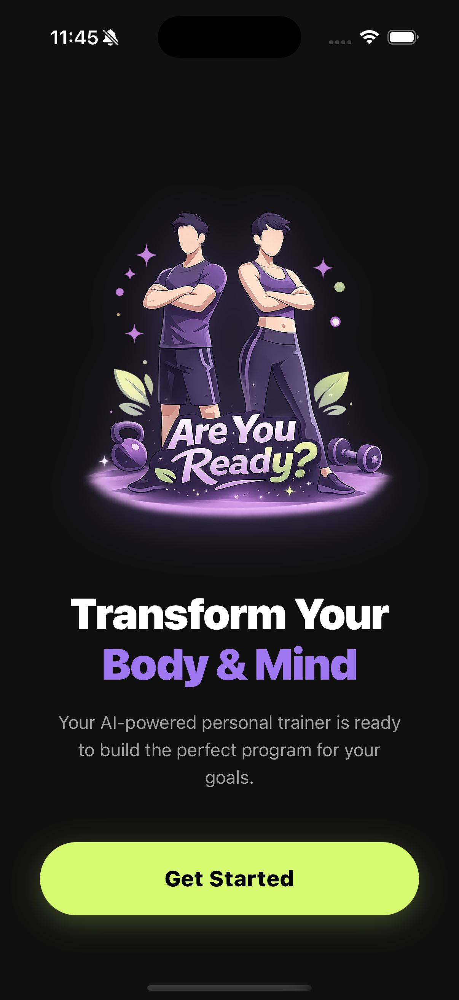
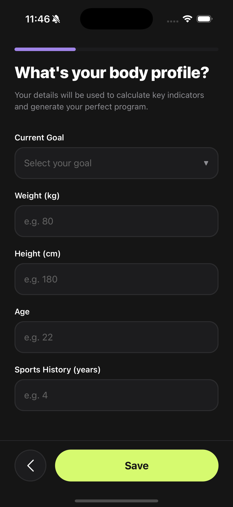
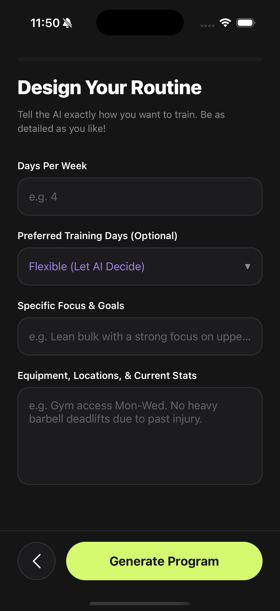
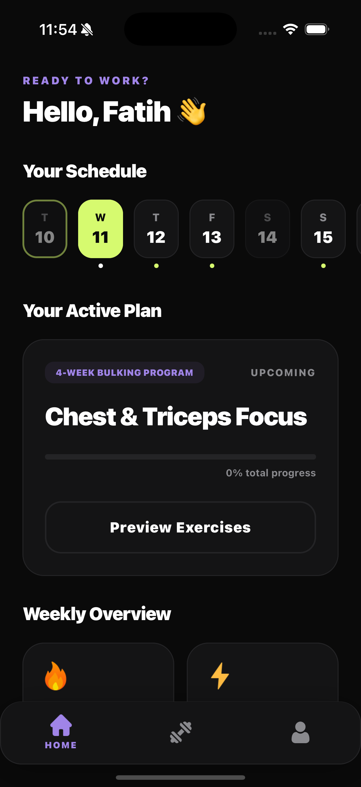
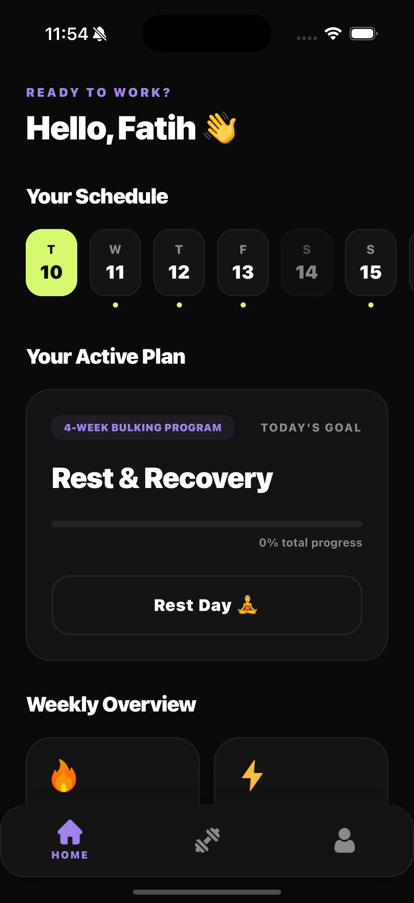
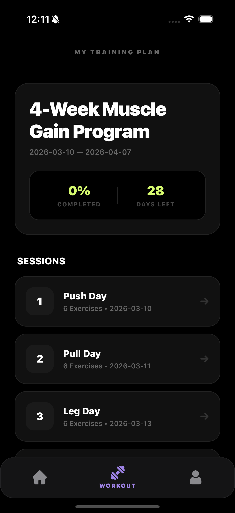
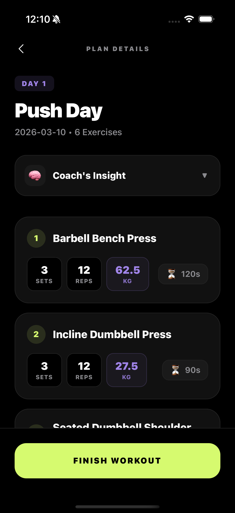

# CoachAI 🏋️‍♂️🤖

A premium, AI-powered mobile fitness application built with **React Native** and **Spring Boot**. CoachAI acts as a personal pocket trainer, generating dynamic, hyper-personalized 30-day workout programs based on user goals, sports history, and body metrics.

---

## 📱 App Screenshots

Here is a look at the core user flow and UI design:

### Authentication & Setup
| Sign In | Start | Fitness Profile | Create Program |
| :---: | :---: | :---: | :---: |
|  |  |  |  |

### Dashboard & Tracking
| Active Day | Rest Day | Full Schedule |
| :---: | :---: | :---: |
|  |  |  |

### Workout Execution
| | Session Complete |
| :---: | :---: |
| |  |

---

## ✨ Key Features

* **Intelligent Program Generation:** Creates tailored routines (e.g., Bodyweight, Hypertrophy) using LLMs to customize workouts to the exact user profile.
* **Smart Dashboard & Timeline:** A responsive linear timeline to track daily progress, upcoming workouts, and completed sessions.
* **Dynamic Workout Engine:** Auto-calculates target sets, reps, and weights, with smart UI fallbacks for bodyweight (`BW`) exercises.
* **AI Coach Insights:** Contextual tips and motivational guidance generated for specific exercises directly within the workout details.

---

## 🛠️ Tech Stack

**Frontend (Mobile):**
* React Native (TypeScript)
* React Navigation (Native Stack & Bottom Tabs)
* Context API (Cascaded State Management)
* Axios for Network Requests

**Backend & AI:**
* https://github.com/fatihsenguun/springbootcoachai